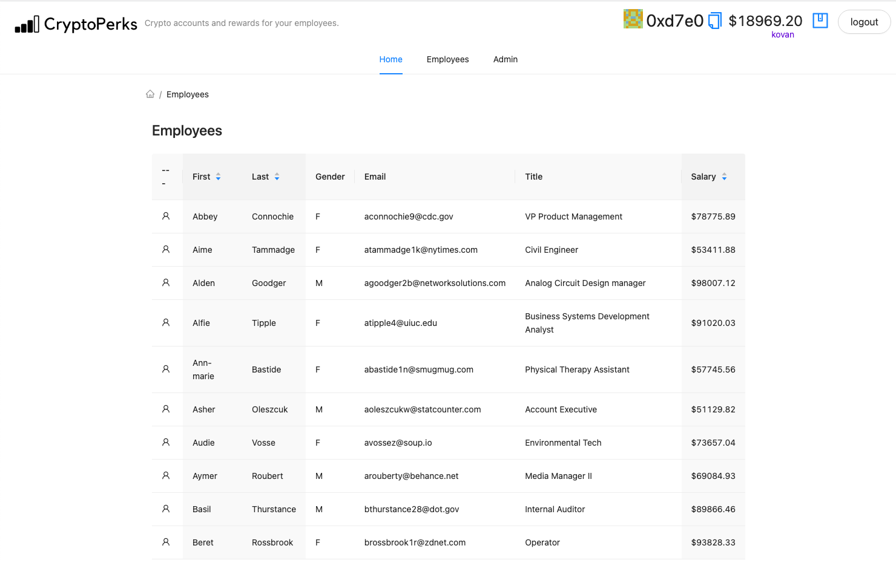

<p align='center'>
    
</p>

## CryptoPerks

Crypto rewards for your employees using interest bearing crypto accounts. Crypoperks uses a variety of hosted blockchain services to create a comprehensive employee profile management platform prototype.

Built for the EthOnline 2021 hackathon.

<b>Note this project is currently for demo purposes on Kovan network and would require additional logic to be mainnet ready.</b>

### Setup

This app uses environment keys to interact with blockchain service backends.

<pre>
REACT_APP_MORALIS_SERVER={YOUR_MORALIS_SERVER_URL} # Admin user authentication and balance access (kovan).
REACT_APP_MORALIS_ID={YOUR_MORALIS_APP_ID} # Admin user authentication and balance access.
REACT_APP_NFT_KEY={YOUR_NFT_STORAGE_KEY} # NFT.storage for employee badge and achievement uploads.
REACT_APP_BITGO_TOKEN={YOUR_BITGO_KEY} # Crypto account creation for employees.
REACT_APP_POCKET_KOVAN_ENDPOINT={YOUR_POCKET_KOVAN_ENDPOINT} # (Optional) Pocket relay for Kovan network.
</pre>

### Research

Employers are expanding employee benefits.

- https://hbr.org/2021/04/the-pandemic-is-changing-employee-benefits
- https://www.benefitspro.com/2020/12/15/trends-to-expect-for-2021-in-a-changing-employee-benefits-industry/
- https://www.benefitspro.com/2021/03/30/analysis-large-employers-are-expanding-offerings-including-voluntary-benefits/?slreturn=20210910120912

### Useful links

- https://admin.moralis.io/servers
- Moralis: https://docs.moralis.io/moralis-server/getting-started/quick-start
- Deploy: https://docs.siasky.net/skynet-workshops/introduction-workshop/part-5-deploy-the-web-app-on-skynet
- NFT storage: https://nft.storage/#getting-started
- Bitgo wallet management: https://github.com/BitGo/BitGoJS/tree/master/modules/core

<!-- https://docs.moralis.io/moralis-server/getting-started/quick-start#authentication -->

- Sponsors: https://showcase.ethglobal.com/ethonline2021/prizes
<!--
https://www.mockaroo.com/
-->

### Sample data

See `./data/employees.csv`

### Sponsors

- <b>AAVE</b>: AAVE is used to give the greatest selection of interest-bearing accounts offered in different ERC-20 supported tokens. The admin or the employee can select the currency most appropriate for their particular goals. The AAVE `OnBehalfOf` deposit feature is leveraged to enable admins to contribute on behalf of employees.
- <b>Paraswap</b>: Dex aggregator used for getting the best exchange rates. For deposits, Paraswap enables swapping between the current currency (Eth) and the target currency for the admins account from the user interface.
- <b>Moralis</b>: Secure login and balance for administrators against Metamask. Employee metadata and wallet information is stored and retrieved using Moralis objects. IPFS connection for retrieving badges.
- <b>Skynet</b>: Deployment and homescreen access: Used to deploy cryptoperks to a a distributed hosting service. Skynet can enable Cryptoperks to be easily accessible for any company admin to open the application from their homescreen.
- <b>Bitgo</b>:wallet creation. BitGo SDKs, WBTC, Smart contracts library extensions and BitGo wallet. Each created wallet can be associated with an employee profile.
- <b>IPFS/Filecoin</b>: Employee badges and record keeping. nft.storage creates a badge represented as an NFT that is transferrable and attached to the employee's record as he/she earns more achievements. Screenshot showing hosted IPFS uploads on the github below.
- <b>Reflexer</b>: The Reflexer RAI is added/demoed as an exchangeable/swappable token for employee crypto account deposits. Reflexer can be paired with Paraswap for easy translation between ETH and RAI by employees and company admins.
- <b>Pocket Network</b>: Used to proxy and track kovan network requests serving the Cryptoperks application. Pocket network offers increased security and transparency into sources of RPC calls against the application (including on Kovan testnet demo). Screenshot of pocket proxying requests on the github below. Relay can be swapped in the app config.

<!--
Demo flow:
* Describe market for employee rewards (links)
* Retention is more important than ever.
* Onboard new people to crypto space
* Set up with interest bearing accounts
* Tour of platform / home page
- Moralis for account creation and auth
* Uploading a new csv of employees
* Managing the employees benefit account
- Moralis for saving metadata
- Grant badges
- Using bitgo to generate accounts.
- Moralis saves the data, show moralis server database (similar to firebase). https://lqnmgj95uf1p.moralishost.com:2083/apps/moralisDashboard/browser/Employee
- Using unique feature of Aave
* Future work and potential/opportunity
-->

<!--
In place:
* Moralis: Backend store (login and watching on smart contracts)
* Skynet: Deploy project front end to skynet (sia) with homescreen support
* IPFS: Using nft.storage for employee badges, records, and achievements.
* Bitgo: wallet creation. BitGo SDKs, WBTC, Smart contracts library extensions and BitGo wallet.
* Paraswap: Multichain swap and dex aggregator. Used for swaps to target liquity/interest pools.

Potential:
* Ether cards: NFT platform to engage, grow, and monetize a social or follower community.
* Sublime: lets borrowers access capital-efficient loans by leveraging their reputation (smart contract based).
* Skale: Deployment
* Conjure: API call from smart contract (ex: feeds)
* Waku: Communication protocol and network built for ethereum. Private chat on employee pages.
* Reflexer: Stable coin
* Zora: Mint and list NFTs

-->

[![Add to Homescreen](https://img.shields.io/badge/Skynet-Add%20To%20Homescreen-00c65e?style=for-the-badge&labelColor=0d0d0d&logo=data:image/png;base64,iVBORw0KGgoAAAANSUhEUgAAACAAAAAbCAYAAAAdx42aAAAABGdBTUEAALGPC/xhBQAAACBjSFJNAAB6JgAAgIQAAPoAAACA6AAAdTAAAOpgAAA6mAAAF3CculE8AAAAeGVYSWZNTQAqAAAACAAFARIAAwAAAAEAAQAAARoABQAAAAEAAABKARsABQAAAAEAAABSASgAAwAAAAEAAgAAh2kABAAAAAEAAABaAAAAAAAAAEgAAAABAAAASAAAAAEAAqACAAQAAAABAAAAIKADAAQAAAABAAAAGwAAAADGhQ7VAAAACXBIWXMAAAsTAAALEwEAmpwYAAACZmlUWHRYTUw6Y29tLmFkb2JlLnhtcAAAAAAAPHg6eG1wbWV0YSB4bWxuczp4PSJhZG9iZTpuczptZXRhLyIgeDp4bXB0az0iWE1QIENvcmUgNi4wLjAiPgogICA8cmRmOlJERiB4bWxuczpyZGY9Imh0dHA6Ly93d3cudzMub3JnLzE5OTkvMDIvMjItcmRmLXN5bnRheC1ucyMiPgogICAgICA8cmRmOkRlc2NyaXB0aW9uIHJkZjphYm91dD0iIgogICAgICAgICAgICB4bWxuczp0aWZmPSJodHRwOi8vbnMuYWRvYmUuY29tL3RpZmYvMS4wLyIKICAgICAgICAgICAgeG1sbnM6ZXhpZj0iaHR0cDovL25zLmFkb2JlLmNvbS9leGlmLzEuMC8iPgogICAgICAgICA8dGlmZjpPcmllbnRhdGlvbj4xPC90aWZmOk9yaWVudGF0aW9uPgogICAgICAgICA8dGlmZjpSZXNvbHV0aW9uVW5pdD4yPC90aWZmOlJlc29sdXRpb25Vbml0PgogICAgICAgICA8ZXhpZjpQaXhlbFlEaW1lbnNpb24+NTM8L2V4aWY6UGl4ZWxZRGltZW5zaW9uPgogICAgICAgICA8ZXhpZjpQaXhlbFhEaW1lbnNpb24+NjQ8L2V4aWY6UGl4ZWxYRGltZW5zaW9uPgogICAgICAgICA8ZXhpZjpDb2xvclNwYWNlPjE8L2V4aWY6Q29sb3JTcGFjZT4KICAgICAgPC9yZGY6RGVzY3JpcHRpb24+CiAgIDwvcmRmOlJERj4KPC94OnhtcG1ldGE+Cnr0gvYAAAe5SURBVEgNlVYJbFzVFT3vL/Nt4yXOyiLahF24EMBrszqhNA1EpZWwK0qxZ2xk0apEpaJFNGkzRCC1VYlUJyoisj22EyrFlqBqaGgqiE0QxPaMSyi1E9JS0pRCwGRx7Njz5289702+lWArSZ8zkz/vv3vvufeee+8T+H9WT7WBVb2uEknVXw9XrENEWw6Bm5Hxr4bnz4IuxmHqHwHBu3D81xGYr6Cq5VMlE9ToEN3e+SbF+T8u+hwKD8SuhQjigKhFrp5Pw0CGOv0gAP9xX0CjWksHDA2wvc+51YqM+DWWtJ7E+U7I0xc1Gr4M4hpE3Ed//YPQtW3IMWZjNB1Q2oFpRJBDYz6Nu/zQJqMASD8nM9zgc5ElMOkeg+83oKLjdXQxErXZSFwaQHj4YOPj9GwLJh0a8tPINXMUviA4oEJtiEMQ+klGJwLH/RI0vZJpWAvLmIMztouIbihgtvcQlnT+PoxEFoD0RUDG78IVhivZ0Mhwt1AR403fCiIm0m4/Q76BHu3j3nRZqSn1vavgG+uZgifID4NR8glEYyRWUm6/jIRAqslE2Xa6xRV6K5/DsA/W3U6yDcILDBp0kR8x+LwVd7Wtl8doWmB7k4HiUz5qSgJ0DwnMKxGoHuKbc4RLNi6F8F8iiPmKH0I7gv9+Xob7/zgmsD82DznBQljeMBbvOKsMK82bqEAESEX3wtC/jnHHRlHEgu1uRVl71ngYIXV+hq8gEOiuNZnvDAaidzAFPSRlIQotjcR9ik78MpuCA9GFCLz76OFRLN35pylVAw21mGPtwvGzDolm0ts3UZZYwfcC8bj8yJRceg3VRFBCEIP1teTGLoIgWcW/6PTtmgrhV9uP4vSsFu7eTI8T6G8oU1p97Q2cSD8Pk9S2DJBcP1H7PXH9so1LAWlcRqu0o4uVsluVqCauQ8ZcwfIihDjL7N6tNpZ2biGIVkTwG7z7SAtOjzqoSPwAgbYEZzMbsff6pAKwKu4q4JInX1xyT/Lii2tkXpaoQmxjFYHNiqXrr7zwYE+cnY7KJaD7jz1PDnwHrtfMnP9C6ZOE9dKLyDwHlTs+nLLxdk0uNFZG1Ytnpvakjk0kJEhM2UPClWrKg595B3nGTeTBngsByEPZSpACAQZja5jubnLDIYN/isqOVqWnr24V336FzD6Mqp2vqbPJhuvgubfxnAthfIAl7YfV2fBLpqDgJqEq7q+xbvaRBzDhvjcdQFZAYKB+tepa8vdAbDfm563DyMQ7BLQB5W2vYs9DhZhtNDHY5eyOvTjhdmINq+jtugpKrCPARcg1jpBw+5Be1K8im9UNHKhrRlHOYzjr/Gc6gLDnpxq6oAUlmPDWYlnnMSSjD1O+g4ICo5k/09OnUdXeh75HFsDyfw5NW8Gg7YPjbEEZz8vyzvPr2Kq/hUAUM4ocTu4eHJ14CVfnbsZs6wmMOZ9OJ1HvSBZUxv2Yxm6Fpb2HwWgU5e07kPZvYTfsxdycb7CmDzAyu9iXC3Fn2w8Zzm8yOtfAMI8gFduPPHEnyjqew+LW5UhnHoXGP1NvxQ0FJ6HjUYxleDzInQ4A1dlAaeIjjPNQxs9HXiSBVP19WN55BK98eA9GJjdJirAx1VLZQRr8HTR/DItbamAHlaqBFUX2EuBxDrANnB+HCeRBfPJJEUn9JIF8QA5wWupD0wGMsIXKZRp/Z8uVdhwOGzkB7lb760ikisRmpmA1vTjEPOexT3wfuv4+gTwN3RhGadtKgvwafT6OK/OfQYH1GYF048r5y8grVlXiDtiZSkxMPDADB0gr2Rteq5uDIobfC66iR3LE/hunxhfjnu7RqflxuKEAY8E2vqtTtS3vABmflxH8CuWJbQpwdoRvxtzcG9jOOaKdvzH2L+L0+AtS13QAUiocSslYG1twjKTLzoG0sxHlHc8qAKUcPlPDRhG0me11lmqzBREg7R1C4MfpcZcCkow9TiI+ieKcBeoCM+mO8vzamQGEkzApS0rrYwpkWjSOUpvEqUYp2d/F/j5c4qpmI4H0P7yIfZ6AjWqmxuFtyOQzb0TuW5Ql8PZe9NTkoyB/E9PXhOLcQpxxvj0zAAk5LMdktAV5ZiNO2TYrwmJyPuPbNahoP6giVcNfg8Xa1EgfjP6MZfesVEHjLgksx7jk0h/geRsZkSH2mBL4uAZVHX+5CIBzXHjzu8W4Iqef6m7ktYogdItvTpOUj5GMO5Uh+RXOBdl2+6JVvKw2M9Tl9JadUWi4ghPNkawWz5GE2aEmB/6UgpkeQi6kordRUIaygDm2YQgrG16vl95uh+30Yp99AnFOvea1Fta/arONrybIXRw4c7MXVsjbtIlii/xwS3BXYljOnIsDkKDCATUQLWded9P4AvaHDA0LemUyGlLhKY7rf9AYicXce/5CVs+1NCzUJwg8Es5gY5NV8FuUJn7ElKhquzSA80G81fhltt0EvV/F/Eqms66YYCEiasbzuqfyLfuG4/OLd0BpOJ9VYXsTVPUUw98sVXJJ20R4uSskpTwvL6mB/2M2oFvP3f1p0KM6Bl36pTHn8gIjAaUdXvOCl8mHZ7Bs5/tZrsSl/7KyFAr5/+UtRbRzwnuY63kLZHe8lyAq6PFCNqM5LFabrfZjah7mXg8MYzdKW/+pDMxwh/wf4xZoOPPcKX0AAAAASUVORK5CYII=)](https://homescreen.hns.siasky.net/#/skylink/https://10035dtb2ito9b2uaeek6i3bga1d5bc8lhjiunmu8do9oodsm74mo2o.siasky.net/)

### Screenshots

<h3>Home page</h3>

<h3>Connecting account with Moralis</h3>

<h3>Uploading a list of employees from a CSV</h3>

<h3>Managing badges/achievements.</h3>

<h3>IPFS upload result</h3>

<h3>Moralis saves wallet and employee metadata each update.</h3>

<h3>Create wallet for each employee</h3>

<h3>Share notes on the particular employee record</h3>

<h3>Discover lending pools for the employee</h3>

<h3>Pocket network used for proxying requests in demo</h3>

<h3>Add to Homescreen</h3>


### Quick Start

Prerequisites: [Node](https://nodejs.org/en/download/) plus [Yarn](https://classic.yarnpkg.com/en/docs/install/) and [Git](https://git-scm.com/downloads)

> clone/fork 🏗 scaffold-eth:

```bash
git clone https://github.com/austintgriffith/scaffold-eth.git
```

> install and start your 👷‍ Hardhat chain:

```bash
cd scaffold-eth
yarn install
yarn chain
```

> in a second terminal window, start your 📱 frontend:

```bash
cd scaffold-eth
yarn start
```

> in a third terminal window, 🛰 deploy your contract:

```bash
cd scaffold-eth
yarn deploy
```

🔏 Edit your smart contract `YourContract.sol` in `packages/hardhat/contracts`

📝 Edit your frontend `App.jsx` in `packages/react-app/src`

💼 Edit your deployment scripts in `packages/hardhat/deploy`

📱 Open http://localhost:3000 to see the app
